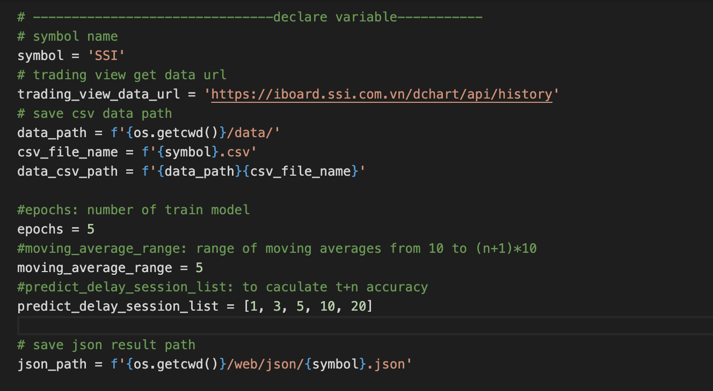

# Predicting stock with LSTM

## Requirements

- python 3.8
- alpha_vantage
- pandas
- numpy
- sklearn
- keras
- tensorflow
- matplotlib
- xlrd
- requests


## Setup project
### Linix/MacOs

1. Clone the repo or use command line
```
git clone https://github.com/quangkhoi1228/predicting_stock_with_LSTM.git
```
2. Go to source code folder
```
cd parentDir/predicting_stock_with_LSTM
```
3. Create runtime environment
```
pip3 install virtualenv
virtualenv envs
source envs/bin/activate
pip install -r requirements.txt --use-feature=2020-resolver
```
### Window
Clone the repo or use command line
```
git clone https://github.com/quangkhoi1228/predicting_stock_with_LSTM.git
```
2. Go to source code folder
```
cd parentDir\predicting_stock_with_LSTM
```
3. Create runtime environment
```
pip3 install virtualenv
virtualenv envs
.\envs\Scripts\activate
pip install -r requirements.txt --use-feature=2020-resolver
```

## Run custom stock symbol
1. Open master_file.py and change stock symbol


2. Run the python file to see the magic